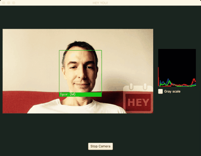

# Hey You!

**Face detection. Face recognition. Gender detection.**

Simple program that analyzes users from their _every-day photos_ and detect them in real-time on the camera feed. Additional gender analysis is performed, too. Just for fun; based on [OpenCV](https://opencv.org).

+ DISCLAIMER #1: all photos used in this project are considered to be free.
+ DISCLAIMER #2: Dear Emma Stone and Ryan Gosling, sorry for mixing my dumb face with yours.  

## Build OpenCV

First you need to build the `OpenCV`. Don't use `brew`! We need to change configuration of `OpenCV` contribution module. This can not be done with `brew`. Hence, build everything manually. See `build_opencv.sh` for more details.

## Train data

Run `/.gradlew train` to train users and gender data. Not all user raw images will be successfully processed, that is fine. More images you have, the better. Frontal face images only! Put them into the `/user/<name>/raw` folder.

Photos used for genders training comes from AT&T dataset.

## Run

Run with `/.gradlew run`. JavaFX dialog opens. Wait for training data to load. Start camera. Smile.

## Example

_It's just me in the La La land_

## ToDo

+ False positives are a big problem. Add eyes detection for better _face recognition_.
+ Detect eyes too! Use eyes position to rotate head and make the face straight, for better _face detection_.
+ Add the better set of input data.
+ Gender detection is not precise.
